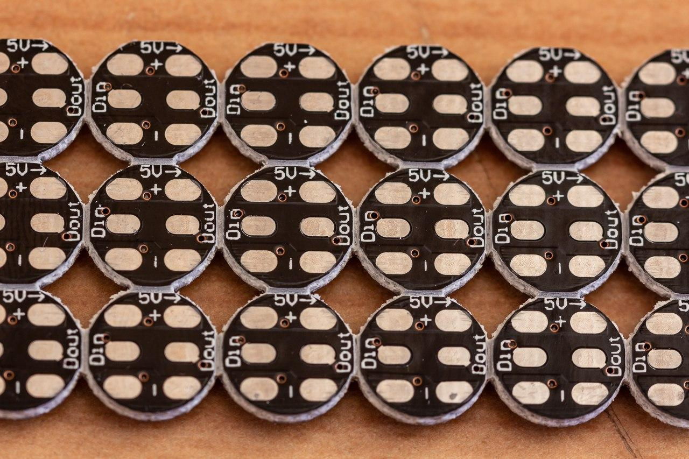
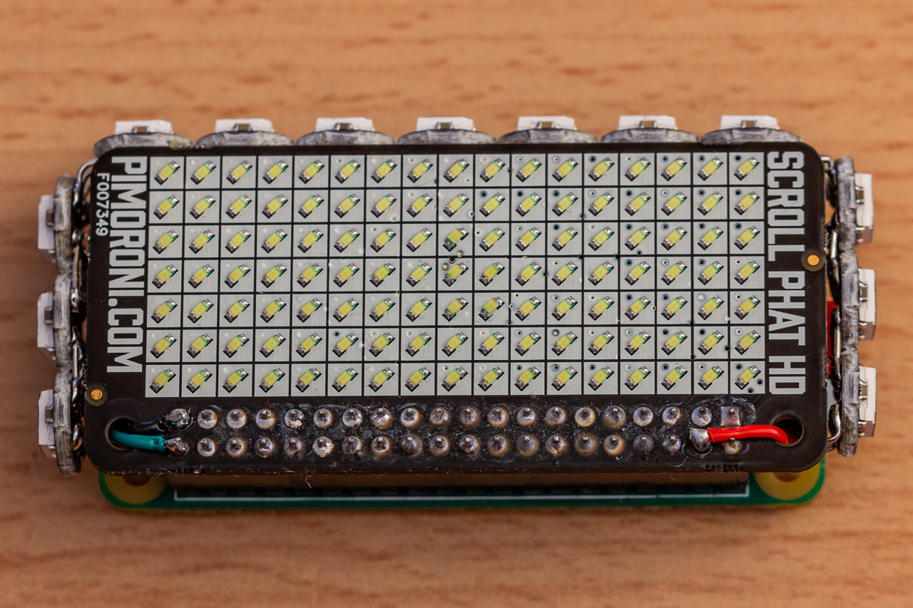
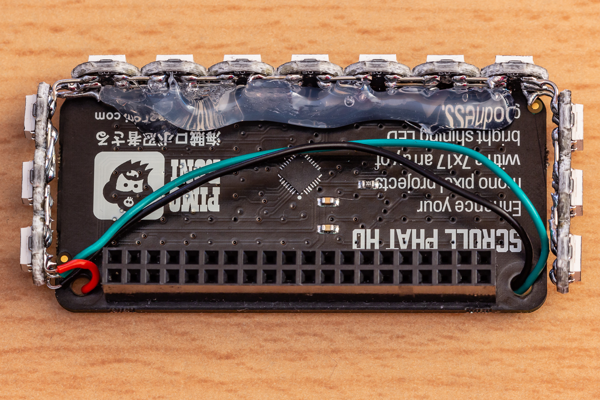
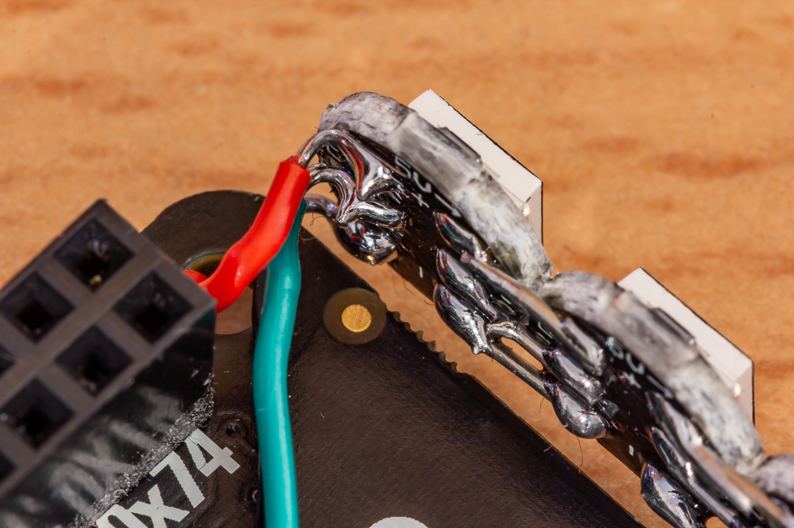
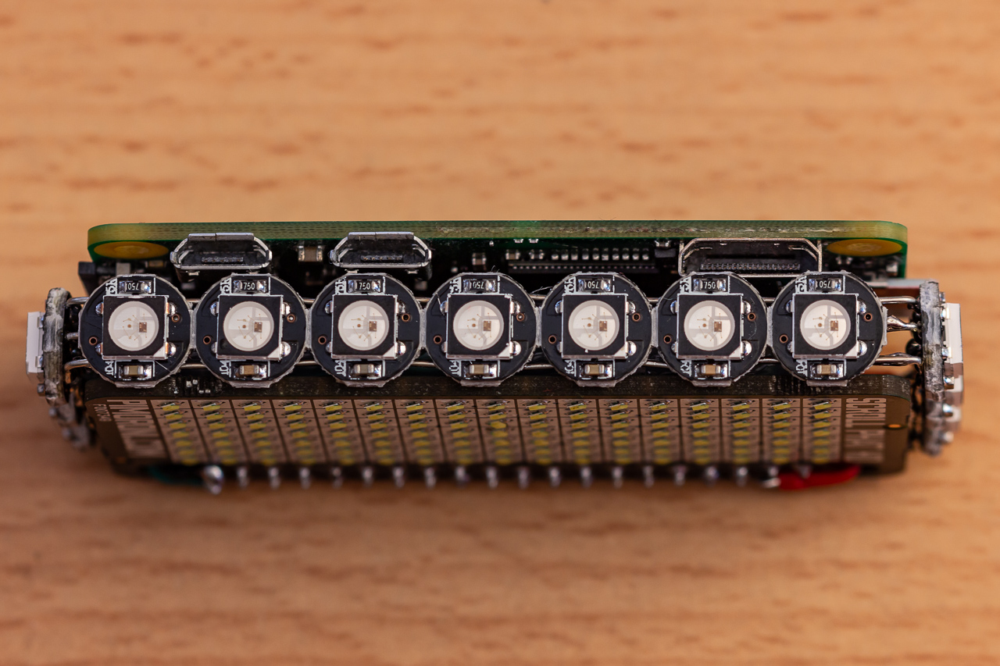

# Scroll pHAT HD on Acid

[](https://www.youtube.com/watch?v=zu3m-J5docg)

I´ve decided to add another layer of awesomeness to my [Pimoroni Scroll pHAT HD](https://shop.pimoroni.com/products/scroll-phat-hd) by adding some fancy RGB LEDs to make it even more blinky.

## Hardware

The setup presented here basically consists of three parts:

- A [Raspberry Pi Zero](https://www.raspberrypi.org/products/raspberry-pi-zero/)
- One [Pimoroni Scroll pHAT HD](https://shop.pimoroni.com/products/scroll-phat-hd) white pixel display
- Thirteen [RGB LEDs based on the WS2812B LED controller](https://www.aliexpress.com/item/10-1000pcs-4-Pin-WS2812B-WS2812-LED-Chip-Heatsink-5V-5050-RGB-WS2811-IC-Built-in/32634454437.html?spm=a2g0s.12269583.0.0.36e96332RHS6MC)

### Assembly

I already had an assembled Scroll pHAT lying around, so I´ll leave this step out (it´s basically just soldering a pin socket onto it).

#### Building the WS2812B LED Strip

The [WS2812B LED´s](https://www.aliexpress.com/item/10-1000pcs-4-Pin-WS2812B-WS2812-LED-Chip-Heatsink-5V-5050-RGB-WS2811-IC-Built-in/32634454437.html?spm=a2g0s.12269583.0.0.36e96332RHS6MC) are pretty straight-forward to handle.

They provide 6 pins:
- 2 x *5V*
- 2 x *GND*
- Din (data in)
- Dout (data out)

You just have to solder them in a row (*5V* to *5V*, *GND* to *GND* and *Dout* to *Din*) to make them work.



[Adafruit](https://www.adafruit.com/) provides libraries for addressing WS2812B LEDs because they sell NeoPixels, which are also compatible with this controller.
That means we can rely on [quality Adafruit library stuff](https://learn.adafruit.com/neopixels-on-raspberry-pi?view=all) here.

I chose the [direct wiring method](https://learn.adafruit.com/neopixels-on-raspberry-pi?view=all#powering-neopixels-from-raspberry-pi-without-level-shifting-3-6), which works for me but may not work for everyone, because:

- The power consumption of the LEDs could overload the Raspberry Pi´s 5V outlet.
- The Raspberry Pi only provides 3.3V on its output pins, while the LED controller expects a level of 5V. Nevertheless, there are tolerances that may make it work with less than 5V. If it does not, then you need a level shifter.

[(It also seems to be best practice to place a resistor before the first data pin and/or add a buffering capacitor.)](https://learn.adafruit.com/adafruit-neopixel-uberguide/best-practices)

Anyway, the "direct wiring" approach works for me.

#### Attaching the Strip to the Scroll pHAT HD

*(Please note the professional way of attaching with incredible amounts of hot glue.)*

The Scroll pHAT only [uses 3 GPIO pins (2, 3 and 5)](https://pinout.xyz/pinout/scroll_phat_hd). According to Adafruit, *"NeoPixels must be connected to GPIO10, GPIO12, GPIO18, or GPIO21 to work! GPIO18 is the standard pin."*.
I decided to connect:

- *5V* to pin 4 (red line)
- *GND* to pin 34 (black line)
- *Din* to pin 40 / GPIO 21 (green line)










## Software

### Prerequisites

### OS

I like to run my Raspberry Pi´s with [DietPi](https://dietpi.com/), a lightweight, minimal distribution. For the Scroll pHAT, *i2c* needs to be enabled, so make sure it is by running `dietpi-config` and check *Advanced Options - I2c state* if it says "Enabled."

It is recommended to perform the following steps as the user `dietpi` (not `root`).

### Libraries

Install the requirements for Scroll pHAT:

```bash
curl https://get.pimoroni.com/scrollphathd | bash
```

- *"Python3 is not installed. Would like to install it?”* - yes
- *“Do you wish to perform a full install? [y/N]”* - yes

Install the requirements for WS2812B (aka NeoPixel):

```bash
sudo pip3 install rpi_ws281x adafruit-circuitpython-neopixel
```

## Test

### Scroll pHAT HD

The full install of the library provides example files in the home directory.

```
python3 ~/Pimoroni/scrollphathd/examples/swirl.py
```

### LED´s

To test the LEDs, I used the [rpi_neopixel_simpletest.py](https://github.com/adafruit/Adafruit_CircuitPython_NeoPixel/blob/master/examples/rpi_neopixel_simpletest.py) example from Adafruit.
Within the script, set `pixel_pin` and `num_pixels` according to your setup (in this case here `pixel_pin = board.D21` and `num_pixels = 13`.
Be aware that the NeoPixel library needs root privileges to run.

```bash
sudo python3 rpi_neopixel_simpletest.py
```

(After closing the script, the LEDs stay on.)
